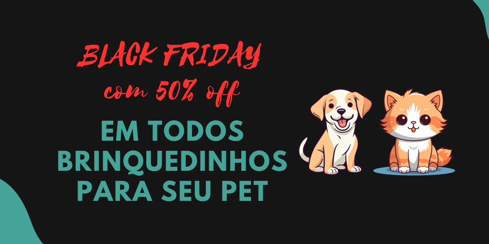

# PetBoutique - Documentação

## Introdução

Bem-vindo à documentação oficial da PetBoutique, sua boutique virtual exclusiva para animais de estimação! Nesta compilação detalhada, fornecemos informações abrangentes e orientações para tornar sua experiência com o PetBoutique suave, agradável e, acima de tudo, recompensadora.

Sobre o PetBoutique:
O PetBoutique é mais do que uma simples loja online para produtos de animais de estimação; é um destino pensado e cuidadosamente projetado para atender às necessidades e desejos de tutores de animais. Em nossa boutique, acreditamos que cada animal de estimação merece o melhor em cuidados, conforto e diversão. Desde alimentos premium até acessórios elegantes, estamos comprometidos em oferecer uma seleção cuidadosamente curada de produtos que refletem a qualidade de vida que você deseja para seus companheiros peludos.

O Que Esperar Nesta Documentação:
Esta documentação é sua guia completa para navegar e utilizar todas as funcionalidades oferecidas pelo PetBoutique. Aqui, você encontrará informações detalhadas sobre a navegação no site, o processo de compra de produtos, informações sobre as marcas parceiras, sugestões de produtos, e uma visão geral de como tirar o máximo proveito da sua experiência de compra.

## Objetivos:
Na PetBoutique, nossa missão é proporcionar uma experiência única e excepcional para tutores de animais de estimação, redefinindo os padrões de cuidado, conforto e estilo para os companheiros peludos em sua vida. Através de um compromisso inabalável com a excelência, buscamos alcançar os seguintes objetivos:

Excelência em Qualidade:

Fornecer produtos de alta qualidade que atendam aos mais altos padrões de segurança e nutrição para animais de estimação.
Variedade e Seleção Cuidadosa:

Oferecer uma ampla variedade de produtos, desde alimentos premium até acessórios elegantes, todos cuidadosamente selecionados para atender às diversas necessidades e gostos de nossos clientes e seus animais de estimação.
Experiência do Cliente Excepcional:

Garantir uma jornada de compra online suave e agradável, desde a navegação intuitiva até o processo de checkout, visando a satisfação total do cliente.
Parcerias Estratégicas:

Estabelecer e manter parcerias estratégicas com marcas reconhecidas por sua dedicação à qualidade e inovação em produtos para animais de estimação.
Transparência e Informação:

Fornecer informações claras e transparentes sobre cada produto, garantindo que os tutores possam tomar decisões informadas para o bem-estar de seus animais de estimação.
Promoção da Saúde Animal:

Apoiar iniciativas e produtos que promovam a saúde e o bem-estar dos animais de estimação, incentivando práticas de cuidado responsáveis.
Engajamento Comunitário:

Estabelecer uma comunidade ativa e engajada de amantes de animais de estimação, compartilhando dicas, histórias e conselhos sobre o cuidado e a felicidade dos animais.
Inovação Contínua:

Permanecer na vanguarda da indústria de produtos para animais de estimação, adotando inovações tecnológicas e desenvolvendo novas ofertas que antecipem e atendam às necessidades emergentes dos tutores de animais de estimação.
Responsabilidade Ambiental:

Adotar práticas sustentáveis e ecológicas sempre que possível, minimizando nosso impacto no meio ambiente.

## Principais Recursos:

Navegação Intuitiva: Explore facilmente nossas categorias de produtos e encontre exatamente o que precisa com uma navegação simples e intuitiva.

Produtos Exclusivos: Descubra produtos exclusivos e de alta qualidade, desde alimentos gourmet até acessórios da moda, cuidadosamente selecionados para seus animais de estimação.

Marcas Parceiras: Conheça as marcas parceiras que compartilham nossa paixão pela excelência em produtos para animais de estimação.

Carrossel Promocional: Fique atualizado sobre ofertas especiais, descontos e produtos em destaque com nosso carrossel promocional.

Login e Registro: Saiba como criar e gerenciar sua conta para uma experiência de compra personalizada.

Explorando a Documentação:
Esta documentação é estruturada de maneira lógica para facilitar a localização de informações específicas. Utilize o índice para navegar rapidamente entre seções ou siga a leitura sequencialmente para uma compreensão abrangente.

Estamos empenhados em oferecer um ambiente online seguro, acessível e gratificante para você e seus animais de estimação. A equipe do PetBoutique agradece por escolher nossa boutique virtual como seu destino preferido para produtos de qualidade para animais de estimação. Boas compras!

## Fontes de pesquisa

Durante o desenvolvimento deste projeto, foram utilizados os seguintes recursos e bibliotecas:

- [Font Awesome](https://fontawesome.com/) - Biblioteca de ícones.
- [Google Fonts](https://fonts.google.com/) - Fontes personalizadas.
- [Coolors](https://coolors.co/) - Paleta de cores
- [Cobasi](https://www.cobasi.com.br/?gad_source=1&gclid=EAIaIQobChMIoOThzfH9ggMVrRmtBh2Nbge_EAAYASAAEgJN-PD_BwE) - Base para front-end
- [Canva](https://www.canva.com/pt_br/) - Utilizado para criação e edição de imagens.
- [Alura](https://www.alura.com.br/) - Utilizado para estudos e desenvolvimento do projeto.

## Identidade Visual

A identidade visual da PetShop foi cuidadosamente escolhida para transmitir uma experiência amigável e acolhedora para os amantes de animais. As cores e elementos visuais foram escolhidos para criar uma atmosfera positiva e confiável.
Utilizamos em base os tons laranja, branco e cores claras, para uma identidade mais clara e transparente possível para seu pet!

## Logotipo

## Banners

## Participantes

Este projeto foi desenvolvido por uma equipe dedicada de colaboradores. Abaixo estão os perfis do GitHub de cada participante:

- [Rhuan Carlos Prazeres](https://github.com/RhuanCarlos019)
- [Lorenzo Zimbres](https://github.com/LoriaLawrenceZ)
- [Luis Bomba](https://github.com/LuisOtavioBeckaman)
